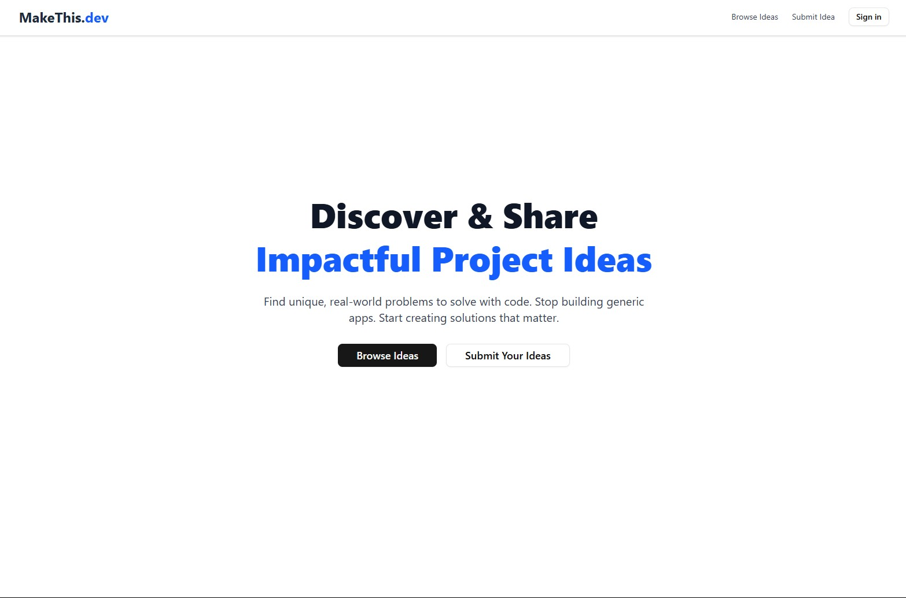

# MakeThis.dev

A platform to share and discover dev-related project ideas.

Made as a submission to [The Bay](https://shipwrecked.hackclub.com/info/the-bay), an online, project-based, summer coding event by Hack Club.

## Features

-   Submit new project ideas with title, description, and optional details.
-   Browse and paginate through existing posted ideas.
-   Upvote ideas you like
-   Profile pages to view project ideas posted by users
-   Edit and delete your own posted ideas.
-   User authentication and secure login using GitHub.
-   Uses PostgreSQL (via Neon) for a reliable database.
-   Built with Next.js, Prisma ORM, and deployed on Vercel.

## Usage

-   Browse ideas on the website.
-   Authentication (via Github) is required for:
    -   Submitting, editing, deleting your own project ideas
    -   Upvoting project ideas
    -   Viewing your profile

## Potential Future Improvements

-   Project tags & filtering.
-   Project comments / discussion.

## Like this project?

If you find this project interesting or useful, consider giving it a star ⭐️!

## License

This project is licensed under the MIT License. See [LICENSE](LICENSE) for more information.
